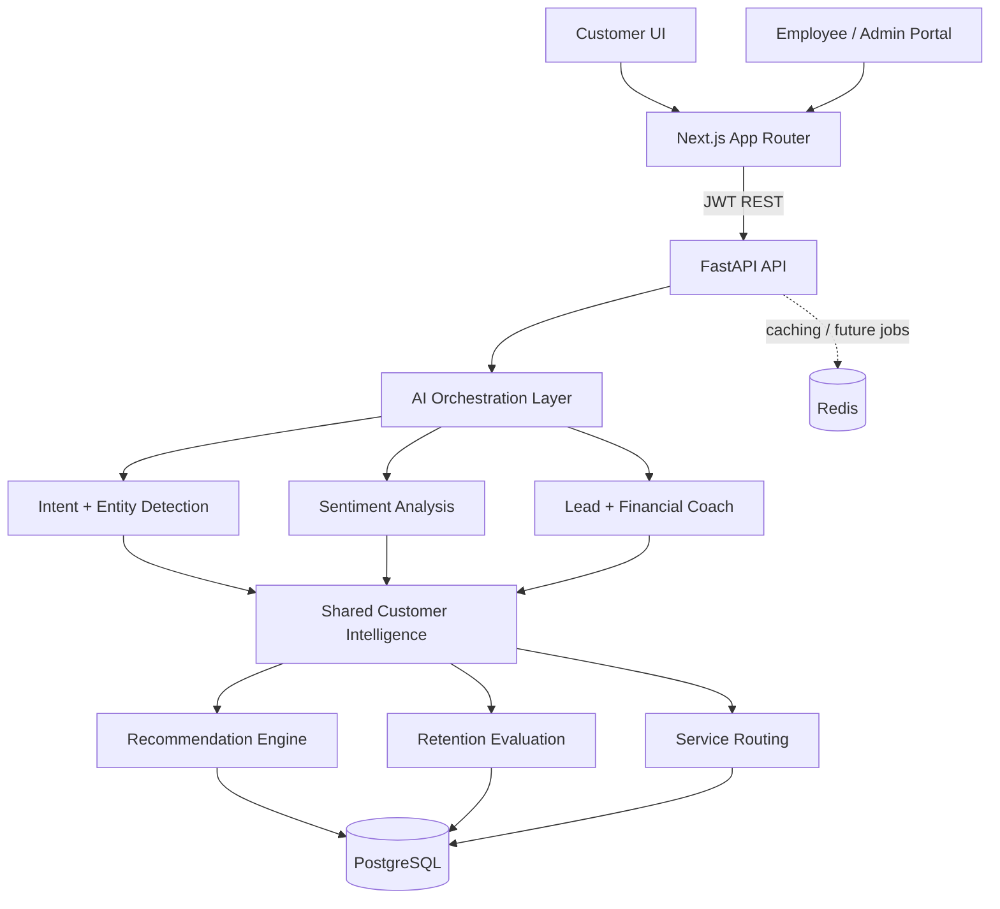

# Architecture

Union Engage AI is a modular monolith for the proof of concept. Domain services share normalized interaction data but remain independently replaceable.

The `MockAIProvider` is deterministic and requires no external API. `services/intelligence.py` defines replaceable classification and scoring boundaries. `services/chat.py` orchestrates one message across those services and persists resulting signals.

Security boundaries include hashed passwords, signed JWTs, employee/customer separation, admin guards, input validation, CORS configuration, and activity audit records. Production would additionally require an identity provider, key rotation, consent controls, encryption/KMS, WAF/rate limiting, threat monitoring, model governance, data retention policies, and independent security validation.

