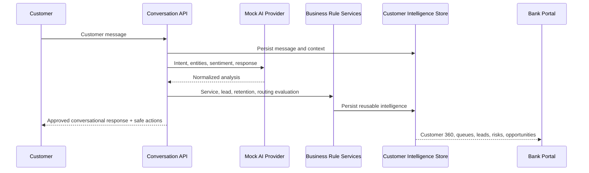

# Unified Message Data Flow

Processing order: receive and validate message; load or create conversation; classify intent; extract entities; analyze sentiment/emotion/urgency; detect service and lead needs; update context; score lead and retention risk; evaluate routing; generate an approved response; persist the complete interaction; expose safe customer actions and internal explainability.

Sales recommendations are suppressed conceptually when sentiment is highly negative or a serious complaint is unresolved. Communication always remains a reviewed employee action.

